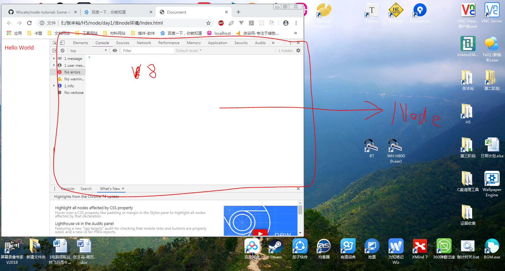
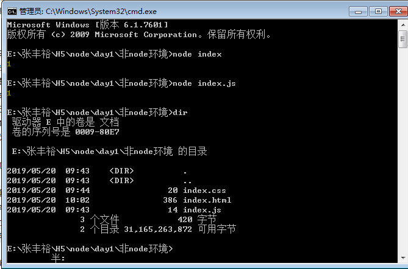

# Node



[Node](http://nodejs.cn/download/)就是把谷歌浏览器的控制台单独抽离了出来(抽离出来的其实是一个运行JS的引擎)，以前我们运行JS必须在浏览器的环境下，现在因为我们把这个(Chrome V8)引擎拿出安装在系统(手机系统，电脑系统，车载系统)上面，并把他命名为(Node)，还有删掉`window`和`document`这些对象，也就是说Node是没有`DOM`和`BOM`的执行环境，虽然把`DOM`和`BOM`删掉了，但是作为补充增加了内置的模块，这些内置都基本底层的方法，浏览器不具备的底层方法

JS从此获得新生(JS以前很孤独，它只能在浏览器区域运作)，因为浏览器把这块土壤放到外部(系统)，JS运行在浏览器的外部，活动范围变大了，从前端语言进化为后端语言（掌握系统的增删查改的权限）

所以node的JS代码里面不能出现这类型的代码

```js
document.getElementById("").xxx //DOM
window.location.href = "" //BOM
```

# 检查Node环境是否安装成功

查看的是你当前Node的版本号

```sh
node -v
```

#  用Node运行JS



你可以在命令行或者终端里面直接运行JS，相对于以前在浏览器里面运行JS是很大的不一样
```sh
node [JS的文件名]
node index.js
node index
```

# 模块化

- require.js 模块化
- `<script type="module" src="xxx.js">`
- gulp模块

模块规范

根据`CommonJS`规范，一个单独的文件就是一个模块。加载模块使用`require`方法和`module.exports`或者`exports`,`module.exports,exports`的区别（深度克隆，指针，深拷贝和浅拷贝）。
- CommonJS NodeJS是这种规范的实现`(require,module.exports,exports)`

AMD规范通过`define`方法去定义模块，通过`require`方法去加载模块。`RequireJS`实现了这种规范。
- AMD

CMD是`SeaJS`在推广过程中对模块定义的规范化产出。国人编写的规范
- CMD

- ES6模块化，`import`和`export`

优势

模块其实就是把复杂的`JS，HTML，CSS`分成一小段

房子在构建过程中会有很多耗材（钉子，木头，铁，螺丝，斧头，锤子），这些小部件其实本质就是一个模块，这些模块互相结合，最终成为一个大厦

- 分工明确
- 容易找锅，容易找出错误
- 方便后期管理
- 前期按需加载

二阶段最经典的模块化，把每份JS分开写，每份JS单独做对应的逻辑，`jquery`负责提供这个操作DOM和BOM的API，AJAX的请求，`jquery-swiper.js`提供轮播图效果(滑块容器)

```html
<script src="jquery.js"></script>
<script src="jquery-swiper.js"></script>
<script src="index.js"></script>
```

### require

使用它来引入外部模块，我们可以新建index.js


```js
console.log(1);
// require引入，获取的意思
require('./module1.js');
// 引入了module2的模块，并且赋值给teacher变量
var teacher = require('./module2');

console.log(teacher.plus(teacher.age , 1));
```

### module.exports

module模块的意思，export是导出的意思

配合`module.exports`导出所需的模块，使用`require`引用，按需加载
```js
// module2.js
var obj = {
    name: "yao",
    age: 18,
    skill: ['ps', 'js', 'css'],
    plus: function (num1, num2) {
        return num1 + num2
    }
}

// 导出模块
// 把上面的obj导出外部使用
module.exports = obj;
```
```js
console.log(2);
```

此时模块1`module1.js`和模块2`module2.js`各司其职，分工明确，配合`index.js`引入这些模块，然后使用完成主逻辑


# 自定义模块

自己写的代码，都叫自定义模块，你自己写的代码里面，引入了其它的模块，但是只要这个模块是你自己写，那这个就是自定义模块


```js
console.log(1);
// require引入，获取的意思
require('./module1.js');
// 引入了module2的模块，并且赋值给teacher变量
var teacher = require('./module2');

console.log(teacher.plus(teacher.age , 1));
```

上面的`index.js`用了两个自己写的模块分别是`module1.js`和`module2.js`，所以这三份JS都是自定义模块

# 第三方模块

- [jQuery](https://jquery.com/download/)
- [gulp](https://www.npmjs.com/package/gulp)

```sh
npm install gulp
npm install jquery
npm install cheerio #在服务端替代jquery
```
使用npm会有可能失败，所以建议使用
```sh
npm install -g cnpm --registry=https://registry.npm.taobao.org
```
如果安装成功，如果有显示结果证明安装成功
```sh
cnpm -v
```

[npm](https://www.npmjs.com)就是第三方模块的市场，应用商店，Node的所有模块将可以在这里被找到

这是第三方模块在JS里面引入的手法，区别就是自定义模块需要相对路径或者绝对路径，建议相对路径，在移植的时候比较好维护，而这个第三方模块只需要用模块名，它会自动识别当前目录下的`node_modules`文件夹里面的内容，寻找出对应的模块，如果当前目录下没有`node_modules`，他会往父目录下寻找
```js
var $ = require('jquery'); // 引入第三方模块
var $ = require('./node_modules/jquery/dist/jquery.js'); // 引入第三方模块
var fs = require('fs'); //引入内置模块
var teacher = require('./module2'); //引入自定义模块
```

# 内置模块

其实就是手机本来有自带摄像功能(内置模块)，但是如果我不满足手机自带的摄像，那我可以去下载第三方的app(B612，美图秀秀)，这些就是我们所说的第三方模块，但是这些第三方模块都要依赖于内置模块

[nodejs的官方api文档](http://nodejs.cn/api/)

内置模块它只需要引入模块名字即可
```js
var fs = require('fs');
var http = require('http');
```

- fs文件系统
fs模块是文件操作系统的方法，它里面对文件的读写都有对应的方法
- http
- buffer缓冲器

## fs

它分同步和异步

`sync`的意思是同步，`async`是异步，而异步是不需要写的，所以node默认是支持异步的，JS是单线程的，如果需要完成多个任务的话，需要用异步解决
```js
var fs = require('fs');
fs.readFile(); //异步
fs.readFileSync(); //同步
```
我们可以用异步的方法读取系统的文件，err错误前置，data数据后置
```js
// node里面的回调函数，一般第一个参数都为err，因为node错误前置
fs.readFile('./input.txt',null, function(err,data){

})
```

## buffer

解码，因为你无法知道你读取的文件是否是文本，音频还是视频，是一个最简单二进制数据

```js
buf.toString(); //buffer二进制转字符串
```

## http

你可以用http模块实现通信，伪造请求，或者创建服务器
```js
var http = require('http');
console.log(http);

// req request请求
// res response响应
http.createServer(function(req,res){
    res.end('hello world')
})
// 服务器监听的端口号
.listen(12345)
```
以上代码可以实现一个简单的服务器

## os

获取操作系统的一些底层信息
```js
const os = require('os');
console.log(os.cpus());
```

